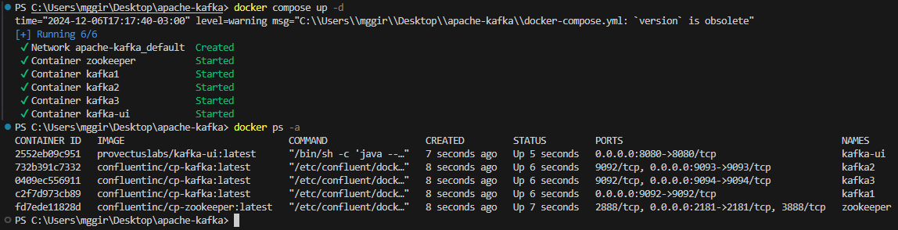
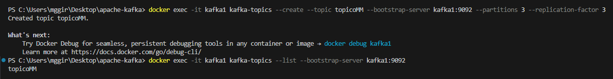
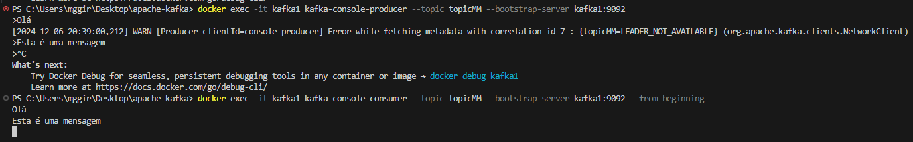
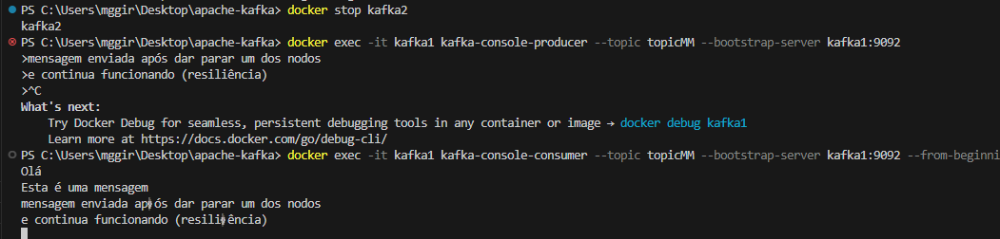
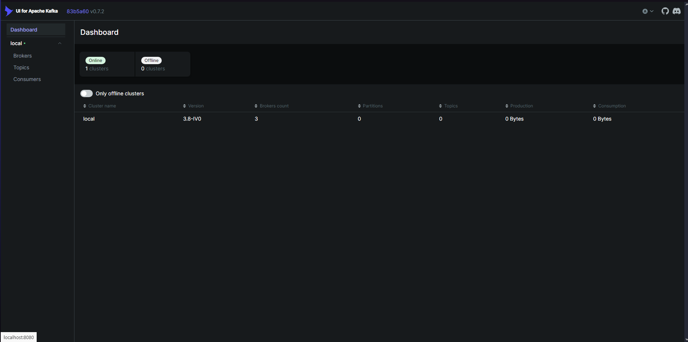
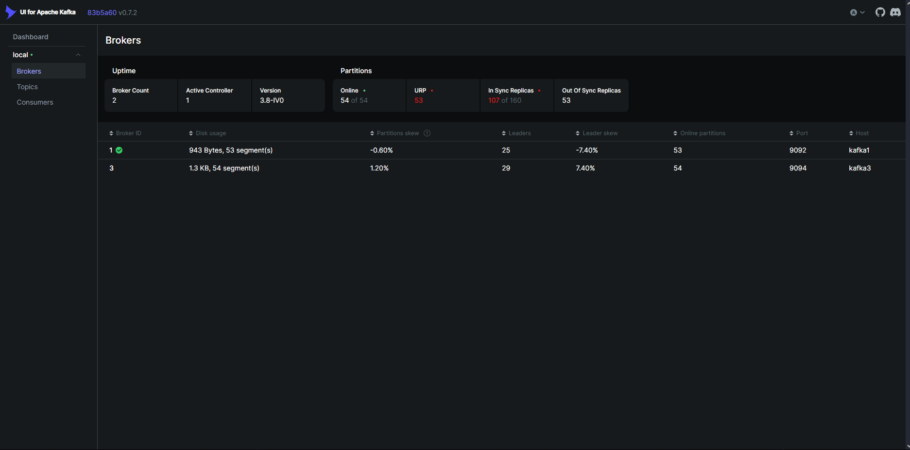
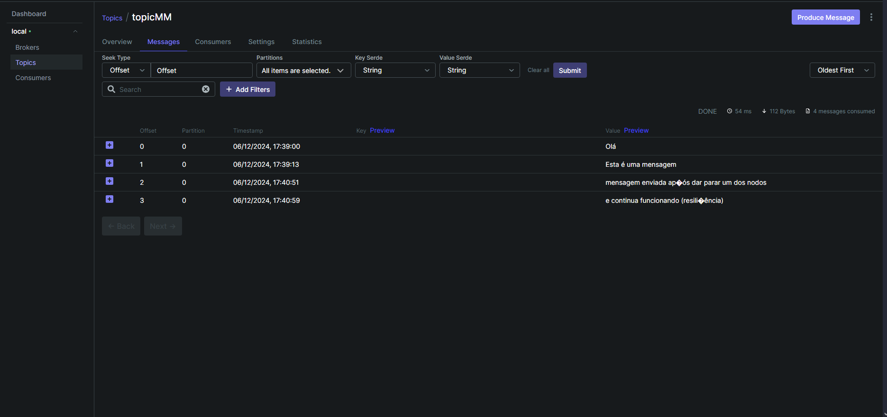

# Trabalho 5
## Matheus Girardi e Maiara Zucco

---

# Passo a passo de instalação
1. Certificar de instalar o Docker Desktop na máquina pelo site;

2. Verificação se o docker está instalado, usando bash:

```
docker --version
```

3. Instalação das imagens com docker pull:

```
docker pull confluentinc/cp-kafka:latest &
docker pull confluentinc/cp-zookeeper:latest &
docker pull provectuslabs/kafka-ui:latest &
```

4. Verificação das imagens:

```
 docker images
```
Se estiver com as 3 imagens listadas, o docker compose funcionará corretamente.

---

## Criação do Ambiente

1. Inicializar docker-compose:

```
docker compose up -d
```
Com isso, evidencia-se a execução do docker-compose.yml.



Visto que há containers funcionando, os nodos e brokers estão funcionando corretamente. 

Agora, para criar um tópico e mandar mensagens, é necessário colocar o seguinte comando no bash:

```
docker exec -it kafka1 kafka-topics --create --topic topicMM --bootstrap-server kafka1:9092 --partitions 3 --replication-factor 3
```

```
docker exec -it kafka1 kafka-topics --list --bootstrap-server kafka1:9092
```



Para mandar as mensagens, usa-se o código abaixo:

```
docker exec -it kafka1 kafka-console-producer --topic topicMM --bootstrap-server kafka1:9092
```
E para visualizá-las após, este:

```
docker exec -it kafka1 kafka-console-consumer --topic topicMM --bootstrap-server kafka1:9092 --from-beginning
```


---

## Derrubar um Nodo

Para derrubar um nodo do cluster, utiliza-se um docker stop, e o nome do nodo que deseja parar.

Mesmo com um dos nodos derrubados, o Produtor e o Consumidor não deixam de funcionar.



## Adicionar um Nodo

Para adicionar um Nodo ao cluster, é necessário primeiro alterar o docker-composer.yml. Estaremos adicionando um nomeado kafka4, e as alterações são as seguintes:
```
docker compose mudado

version: "3.8"
services:
  zookeeper:
    image: confluentinc/cp-zookeeper:latest
    container_name: zookeeper
    environment:
      ZOOKEEPER_CLIENT_PORT: 2181
      ZOOKEEPER_TICK_TIME: 2000
    ports:
      - "2181:2181"

  kafka1:
    image: confluentinc/cp-kafka:latest
    container_name: kafka1
    ports:
      - "9092:9092"
    environment:
      KAFKA_ZOOKEEPER_CONNECT: "zookeeper:2181"
      KAFKA_BROKER_ID: 1
      KAFKA_ADVERTISED_LISTENERS: "PLAINTEXT://kafka1:9092"
      KAFKA_OFFSETS_TOPIC_REPLICATION_FACTOR: 3
    depends_on:
      - zookeeper

  kafka2:
    image: confluentinc/cp-kafka:latest
    container_name: kafka2
    ports:
      - "9093:9093"
    environment:
      KAFKA_ZOOKEEPER_CONNECT: "zookeeper:2181"
      KAFKA_BROKER_ID: 2
      KAFKA_ADVERTISED_LISTENERS: "PLAINTEXT://kafka2:9093"
      KAFKA_OFFSETS_TOPIC_REPLICATION_FACTOR: 3
    depends_on:
      - zookeeper

  kafka3:
    image: confluentinc/cp-kafka:latest
    container_name: kafka3
    ports:
      - "9094:9094"
    environment:
      KAFKA_ZOOKEEPER_CONNECT: "zookeeper:2181"
      KAFKA_BROKER_ID: 3
      KAFKA_ADVERTISED_LISTENERS: "PLAINTEXT://kafka3:9094"
      KAFKA_OFFSETS_TOPIC_REPLICATION_FACTOR: 3
    depends_on:
      - zookeeper

  kafka4:
    image: confluentinc/cp-kafka:latest
    container_name: kafka4
    ports:
      - "9095:9095"
    environment:
      KAFKA_ZOOKEEPER_CONNECT: "zookeeper:2181"
      KAFKA_BROKER_ID: 4
      KAFKA_ADVERTISED_LISTENERS: "PLAINTEXT://kafka4:9095"
      KAFKA_OFFSETS_TOPIC_REPLICATION_FACTOR: 3
    depends_on:
      - zookeeper

  kafka-ui:
    image: provectuslabs/kafka-ui:latest
    container_name: kafka-ui
    ports:
      - "8080:8080"
    environment:
      KAFKA_CLUSTERS_0_NAME: local
      KAFKA_CLUSTERS_0_BOOTSTRAP_SERVERS: "kafka1:9092,kafka2:9093,kafka3:9094,kafka4:9095"
    depends_on:
      - kafka1
      - kafka2
      - kafka3
      - kafka4

volumes:
  kafka_data1:
    driver: local
  kafka_data2:
    driver: local
  kafka_data3:
    driver: local
  kafka_data4:
    driver: local
```
Logo, basta rodar o comando docker compose up -d kafka4, que o novo nodo será adicionado.
Evidencia-se que mesmo com a alteração do número de nodos, tanto ao derrubar os que já existem quanto adicionar novos, o cluster continua resiliente.


## Interface Gráfica - Kafka UI

Para acessar a interface gráfica, basta acessar o localhost:8080 no seu navegador. A interface gráfica é ótima para melhor visualização e configuração do cluster que você manuseia. Abaixo, prints da interface:

```
http://localhost:8080/
```



